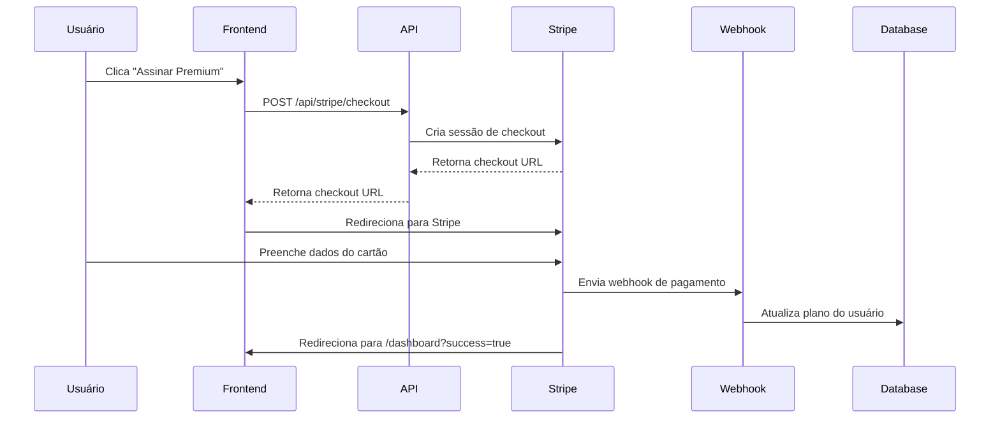
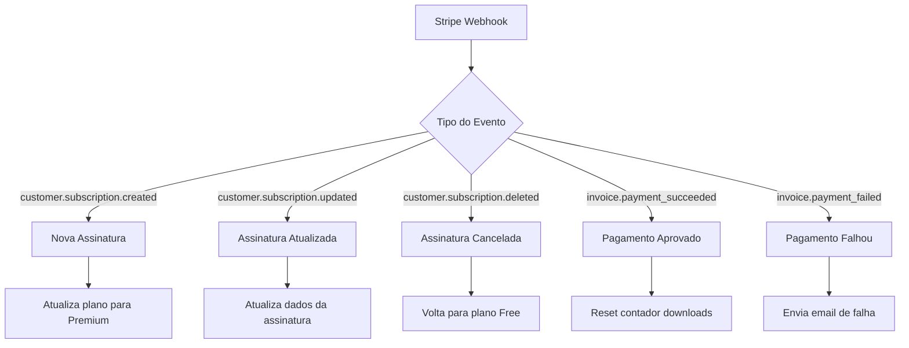

# 📊 Fluxo de Pagamento - Visual

## 🎯 Visão Geral

O sistema de pagamentos do Gerador de Currículos com IA funciona da seguinte forma:

```
[Usuário] → [Página Pricing] → [Stripe Checkout] → [Webhook] → [Atualização do Plano]
```

## 📱 Interface do Usuário

### 1. Página de Pricing (`/pricing`)

```
┌─────────────────────────────────────────────────────────────┐
│                    Escolha seu plano                       │
├─────────────────┬─────────────────┬─────────────────────────┤
│   GRATUITO      │    PREMIUM      │    PREMIUM ANUAL        │
│                 │    (Popular)    │                         │
│   R$ 0,00       │   R$ 5,90       │   R$ 19,90              │
│   /mês          │   /mês          │   /ano                  │
│                 │                 │                         │
│ • 3 downloads   │ • Ilimitado     │ • Tudo do Premium       │
│ • 2 templates   │ • 6+ templates  │ • Economia 2 meses      │
│ • 5 IAs/mês     │ • IA ilimitada  │ • Templates exclusivos  │
│                 │ • Suporte prio  │ • Consultoria 1x        │
│                 │                 │                         │
│ [Começar Grátis]│ [Assinar Agora] │ [Assinar Anual]         │
└─────────────────┴─────────────────┴─────────────────────────┘
```

### 2. Dashboard com Status da Assinatura

```
┌─────────────────────────────────────────────────────────────┐
│ Dashboard - Gerador de Currículos                          │
├─────────────────────────────────────────────────────────────┤
│ 📊 Plano Atual: Premium                                    │
│ 📅 Próxima cobrança: 15/01/2025                            │
│ 📥 Downloads este mês: 15 de ∞                             │
│                                                             │
│ [Gerenciar Assinatura] [Criar Currículo] [Ver Templates]   │
└─────────────────────────────────────────────────────────────┘
```

## 🔄 Fluxo Técnico

### 1. Checkout Process



### 2. Webhook Events



## 💾 Estrutura de Dados

### User Model (Prisma)

```prisma
model User {
  id               String    @id @default(cuid())
  email            String    @unique
  name             String?
  stripeCustomerId String?   @unique
  plan             String    @default("free")       // "free", "premium"
  planExpiresAt    DateTime?                        // Data de expiração
  downloads        Int       @default(0)            // Downloads no mês atual
  createdAt        DateTime  @default(now())
  updatedAt        DateTime  @updatedAt
}
```

### Planos Disponíveis

```typescript
interface PricingPlan {
  id: string              // "free", "premium", "premium-yearly"
  name: string            // Nome exibido
  price: number           // Preço em reais
  interval: "month"|"year" // Frequência de cobrança
  stripePriceId: string   // ID do preço no Stripe
  features: string[]      // Lista de funcionalidades
}
```

## 🧪 Teste do Sistema

### 1. Cartões de Teste

| Cenário | Número do Cartão | Resultado |
|---------|------------------|-----------|
| ✅ Sucesso | `4242 4242 4242 4242` | Pagamento aprovado |
| ❌ Falha | `4000 0000 0000 0002` | Cartão recusado |
| 🔒 3D Secure | `4000 0000 0000 3220` | Requer autenticação |
| 💸 Sem saldo | `4000 0000 0000 9995` | Saldo insuficiente |

### 2. Fluxo de Teste Completo

1. **Setup Inicial**
   ```bash
   npm run dev
   # Terminal 1: Servidor local
   
   ngrok http 3000
   # Terminal 2: Túnel para webhooks
   ```

2. **Teste de Upgrade**
   ```
   /pricing → Selecionar Premium → Pagar com 4242... → /dashboard?success=true
   ```

3. **Verificações**
   - [ ] Usuário redirecionado corretamente
   - [ ] Plano atualizado no banco
   - [ ] Downloads resetados para 0
   - [ ] Webhook recebido no Stripe Dashboard

## 🚀 Deploy em Produção

### 1. Variáveis de Ambiente

```bash
# Produção - use chaves live
STRIPE_PUBLISHABLE_KEY="pk_live_..."
STRIPE_SECRET_KEY="sk_live_..."
STRIPE_WEBHOOK_SECRET="whsec_live_..."
```

### 2. Webhook em Produção

Configure webhook com:
- **URL**: `https://seudominio.com/api/stripe/webhook`
- **Eventos**: Mesmos do desenvolvimento
- **Secret**: Novo secret para produção

### 3. Configuração de Impostos

No Stripe Dashboard:
- Ative "Tax Settings"
- Configure para Brazil
- Habilite cálculo automático de impostos

## 📈 Métricas e Monitoramento

### KPIs Importantes

1. **Conversão**: % de visitantes que assinam
2. **Churn Rate**: % de cancelamentos mensais
3. **MRR**: Receita recorrente mensal
4. **LTV**: Valor do tempo de vida do cliente

### Dashboards Recomendados

1. **Stripe Dashboard**: Métricas financeiras
2. **Analytics**: Comportamento dos usuários
3. **Logs**: Monitoramento de erros

---

**🎯 Objetivo**: Sistema robusto de pagamentos que converte visitantes em clientes pagantes, com UX excelente e operação automatizada.
